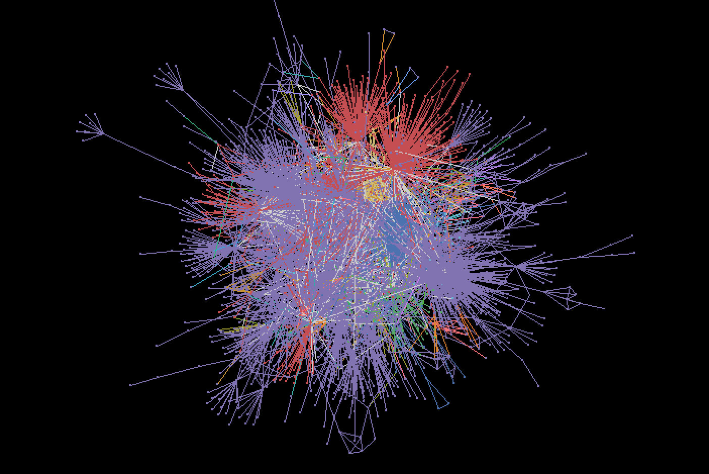

# igraph Community Detection Service
## Introduction
igraph is a collection of network analysis tools with the emphasis on efficiency, portability and ease of use. This is an example service to detect communities, and add color code for each community.

## Quick Start

1. Install Docker: https://store.docker.com/search?type=edition&offering=community
1. (Optional) Install jq
1. Make sure you also have latest version of Docker Compose
1. From this directory, type ```docker-compose build && docker-compose up```
1. ```curl -d "@./sample-data/sample.cx" -H "Content-Type: application/json" -X POST localhost | jq .```
1. Now you should get a network with some new network attributes.

## Path Parameters

### type
Type of community algorithm

* fastgreedy  
    _fastgreedy_ don't support for multiple edge network.
* label_propagation
* optimal_modularity  
    _optimal_modularity_ is  **unlikely to work for graphs larger than a few (less than a hundred) vertices.**
* leading_eigenvector
* edge_betweenness

#### Default value
**fastgreedy**

### palette
Name of color palette for painting in Cytoscape.
color palettes of `seaborn` can be used as this parameter.
About color palette, see http://seaborn.pydata.org/tutorial/color_palettes.html

#### Default value
**husl**

### weights
Name of an edge attribute or a list containing edge weights.
The name of edgeAttribute can be used.
#### Default value
**None**

### initial  (label_propagation)
Name of a vertex attribute or a list containing the initial vertex labels. The name of nodeAttribute can be used.

#### Default value
**None**

### fixed  (label_propagation)
A list of booleans for each vertex. True corresponds to vertices whose labeling should not change during the algorithm. The name of nodeAttribute can be used.

#### Default value
**None**

---
## Example

```http://localhost?type=label_propagation```  


```http://localhost?type=leading_eigenvector&clusters=10&palette=Reds```


## Body
Required input fields are:

* nodes
* edges

## Output

* nodeAttributes
