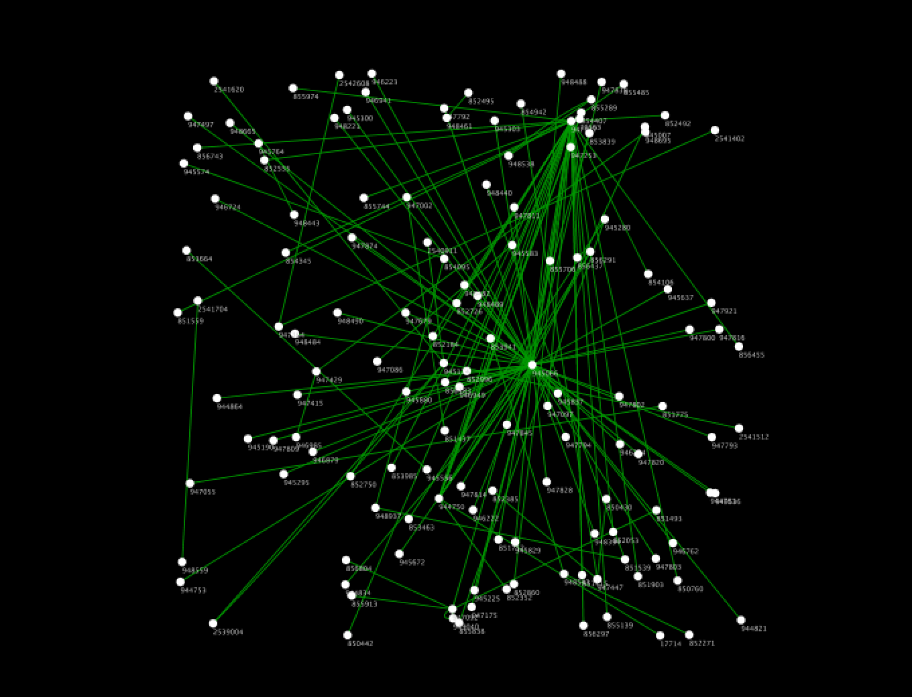
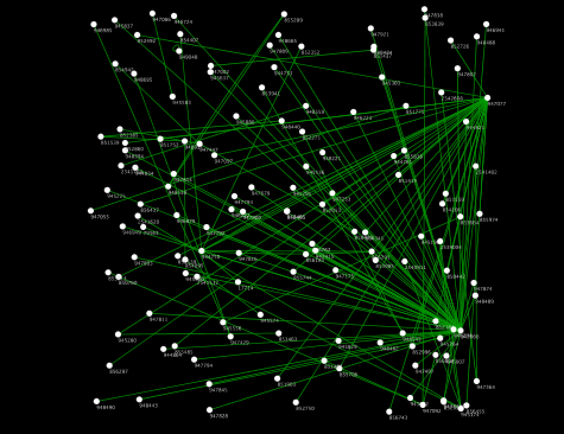
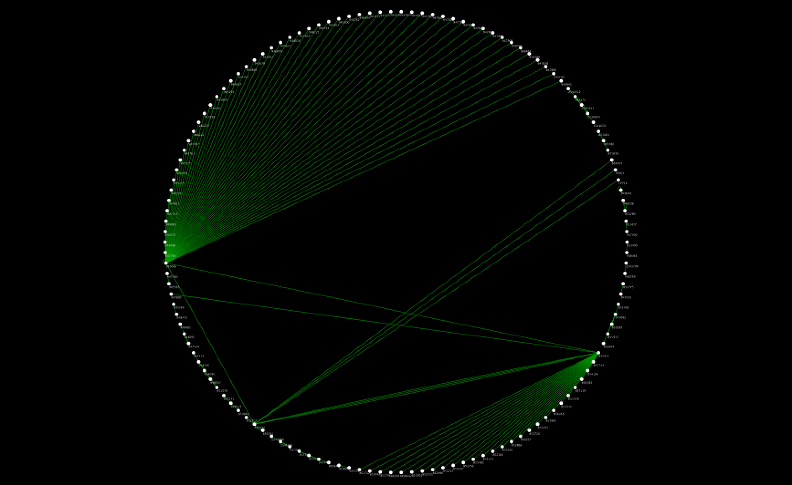
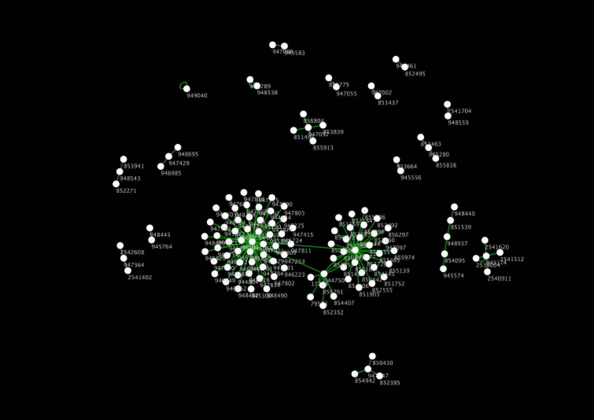

# igraph Layout Service
## Introduction
igraph is a collection of network analysis tools with the emphasis on efficiency, portability and ease of use. This is an example service to perform layout algorithms.

## Quick Start
1. Install Docker: https://store.docker.com/search?type=edition&offering=community
1. (Optional) Install jq
1. Make sure you also have latest version of Docker Compose
1. From this directory, type ```docker-compose build && docker-compose up```
1. ```curl -d "@./sample-data/sample.cx" -H "Content-Type: application/json" -X POST "localhost:3000" | jq .```
1. Now you should get a network with some new network attributes.


# REST API Specification

## Path Parameters
### layout
Type of layout algorithm.  
About detail, See http://igraph.org/python/doc/igraph.Graph-class.html#layout_bipartite   
Some parameters and layouts are not supported now.

* bipartite
    - types, hgap, vgap, maxiter 
* circle
    - dim
* drl
    - weights, seed, fixed, options, dim
* fruchterman_reingold
    - weights, maxiter, maxdelta, area, coolexp, repulserad, minx, maxx, miny, maxy, minz, maxz, seed, dim
* graphopt
    - niter, node_charge, node_mass, spring_length, spring_constant, max_sa_movement, seed
* grid
    - width, height, dim
* kamada_kawai
    - maxiter, sigma, initemp, coolexp, kkconst, minx, maxx, miny, maxy, minz, maxz, seed, dim
* lgl
    - maxiter, maxdelta, area, coolexp, repulserad, cellsize, root
* random
    - dim
* reingold_tilford __(unsupported now)__
    - mode, root, rootlevel
* reingold_tilford_circular __(unsupported now)__
    - mode, root, rootlevel
* star
    - center, order

#### Default value
**circle**

### types
an igraph vector containing the vertex types(boolean), or an attribute name. nodeAttributes can be used.
#### Default value
**types**

### hgap
minimum horizontal gap between vertices in the same layer.
#### Type
_number_
#### Default value
**1**

### vgap
vertical gap between the two layers.
#### Type
_number_
#### Default value
**1**

### options
you can select from five default preset parameterisations.(default, coarsen, coarsest, refine)
#### Default value
**defalut**

### minx, miny, minz
it must be a vector with exactly as many elements as there are vertices in the graph. Each element is a minimum constraint on the X (Y, Z) value of the vertex in the layout. nodeAttributes can be used.
#### Default value
**None**

### maxx, maxy, maxz
it must be a vector with exactly as many elements as there are vertices in the graph. Each element is a maximum constraints on the X (,Y ,Z) value of the vertex in the layout. nodeAttributes can be used.
#### Default value
**None**

### weights
edge weights to be used. Can be a sequence or iterable or even an edge attribute name. The name of edgeAttributes can be used.
#### Default value
**None**

### fixed
you can specify some vertices to be kept fixed at their original position in the seed by passing an appropriate list here(boolean list). The name of nodeAttributes can be used.
#### Default value
**None**

### maxiter
the number of iterations to perform.
#### Default value
**None**

### maxdelta
the maximum distance to move a vertex in an iteration. 
#### Type
_number_
#### Default value
**-1**

### area
the area of the square on which the vertices will be placed. 
#### Type
_number_
#### Default value
**-1**

### coolexp
The cooling exponent of the simulated annealing.
#### Default value
**None**

### repulserad
determines the radius at which vertex-vertex repulsion cancels out attraction of adjacent vertices.
#### Type
_number_
#### Default value
**-1**

### seed_ *(Unsupported now)
if None, uses a random starting layout for the algorithm. If a matrix (list of lists), uses the given matrix as the starting position.
#### Default value
**None**

### dim
the desired number of dimensions for the layout. dim=2 means a 2D layout, dim=3 means a 3D layout.
#### Default value
**2**

### niter
the number of iterations to perform.
#### Type
_integer_
#### Default value
**500**

### node_charge
the number of iterations to perform.
#### Type
_number_
#### Default value
**0.001**

### node_mass
the mass of the vertices, used for the spring forces.
#### Type
_integer_
#### Default value
**30**

### spring_length
the length of the springs.
#### Type
_integer_
#### Default value
**0**

### spring_constant
the spring constant.
#### Type
_integer_
#### Default value
**1**

### max_sa_movement
the maximum amount of movement allowed in a single step along a single axis.
#### Type
_integer_
#### Default value
**5**

### width
the number of vertices in a single row of the layout.
#### Type
_integer_
#### Default value
**0**

### height
the number of vertices in a single column of the layout. It must not be given if the number of dimensions is 2.
#### Type
_integer_
#### Default value
**0**

### sigma
the standard base deviation of the position change proposals. None means the number of vertices / 4
#### Type
_number_
#### Default value
**-1**

### initemp
initial temperature of the simulated annealing.
#### Type
_number_
#### Default value
**10**

### kkconst
the Kamada-Kawai vertex attraction constant. None means the square of the number of vertices.
#### Type
_number_
#### Default value
**-1**

### cellsize
the size of the grid cells.
#### Type
_number_
#### Default value
**-1**

### mode
It specifies which edges to consider when builing the tree.(in, out, all)
#### Default value
**out**

### root *(Unsupported now)*
the index of the root vertex or root vertices.
#### Default value
**None**

### rootlevel *(Unsupported now)*
It specifies the level of the root vertices for every tree in the forest.
#### Default value
**None**

### center *(Unsupported now)*
the ID of the vertex to put in the center.
#### Type
_integer_
#### Default value
**0**

### order
a numeric vector giving the order of the vertices (including the center vertex!).
#### Default value
**None**

---
## Example

```http///localhost/3000?layout=random```  


```http///localhost/3000?layout=lgl```  


```http///localhost/3000?layout=circle```  


```http///localhost/3000?layout=graphopt```  



## Body
Required CX input fields are:

* nodes
* edges
* nodeAttributes
* edgeAttributes
* networkAttributes

## Output

* cartesianLayout
