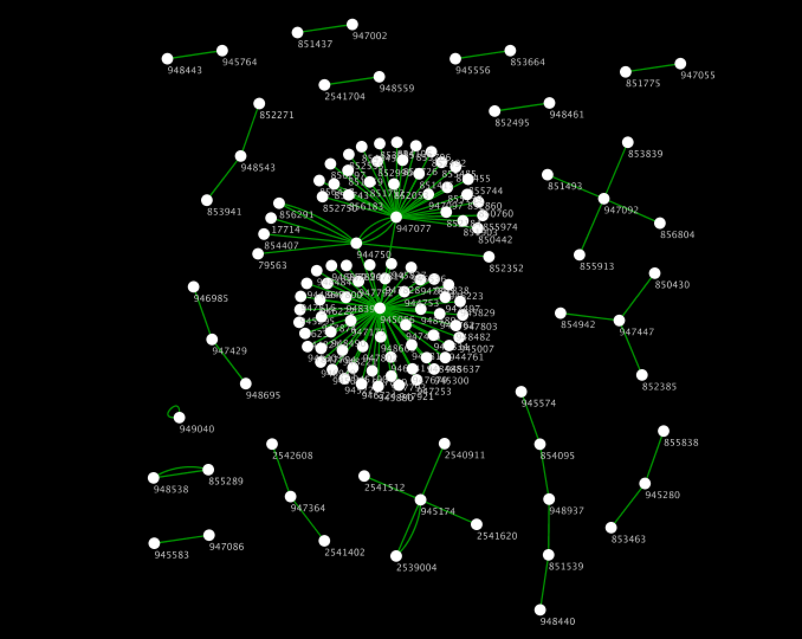
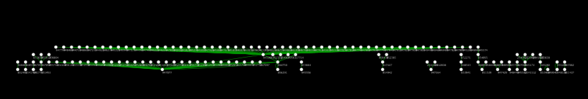
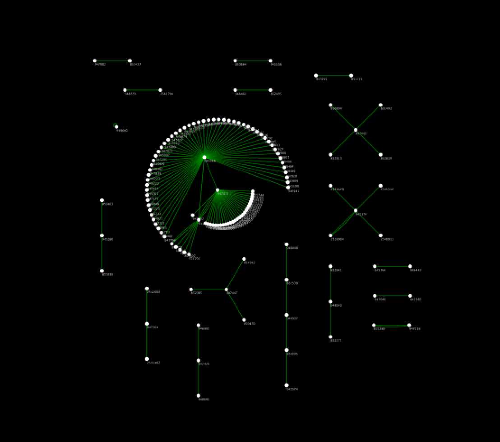
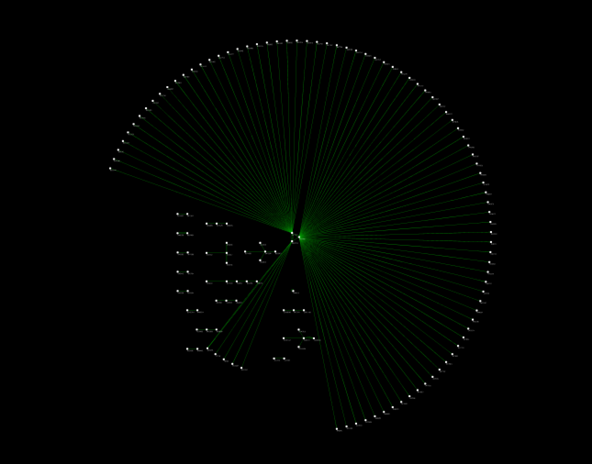
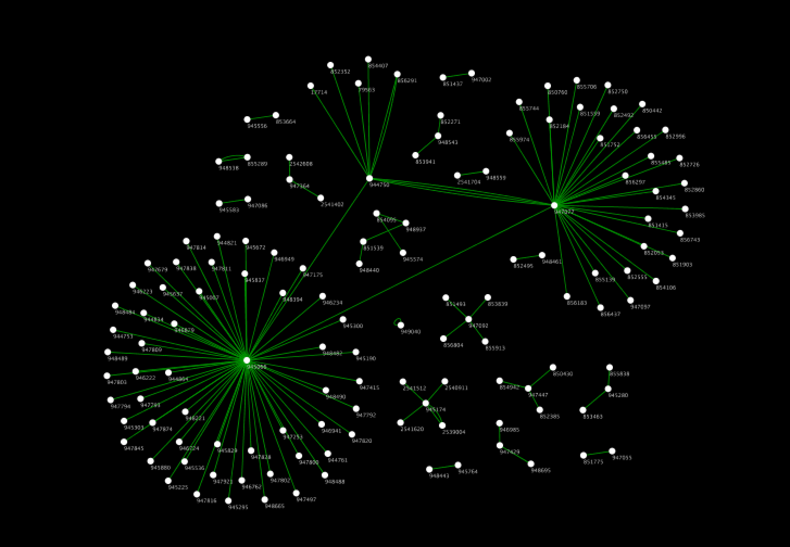

# NetworkX Layout Services
## Introduction
NetworkX is a Python package for the creation, manipulation, and study of the structure, dynamics, and functions of complex networks.
This is an example service to perform layout algorithms.

## Quick Start
1. Install Docker: https://store.docker.com/search?type=edition&offering=community
1. (Optional) Install jq
1. Make sure you also have latest version of Docker Compose
1. From this directory, type ```docker-compose build && docker-compose up```
1. ```curl -d "@./sample-data/sample.cx" -H "Content-Type: application/json" -X POST localhost | jq .```
1. Now you should get a network with some new network attributes.


# REST API Specification

## Path Parameters
### prog
Name of Graphviz layout program.  
If _twopi_ is selected, 'root' value in networkAttribute is used for root node.
#### Default value
**neato**

#### Available values
* neato
* dot
* fdp
* circo
* twopi


## Example
```http://localhost:8080?prog=neato```  

```http://localhost:8080?prog=dot```  

```http://localhost:8080?prog=twopi```  

```http://localhost:8080?prog=circo```  

```http://localhost:8080?prog=fdp```  


## Body
Required CX input fields are:

* nodes
* edges
* networkAttributes


## Output

* cartesianLayout
